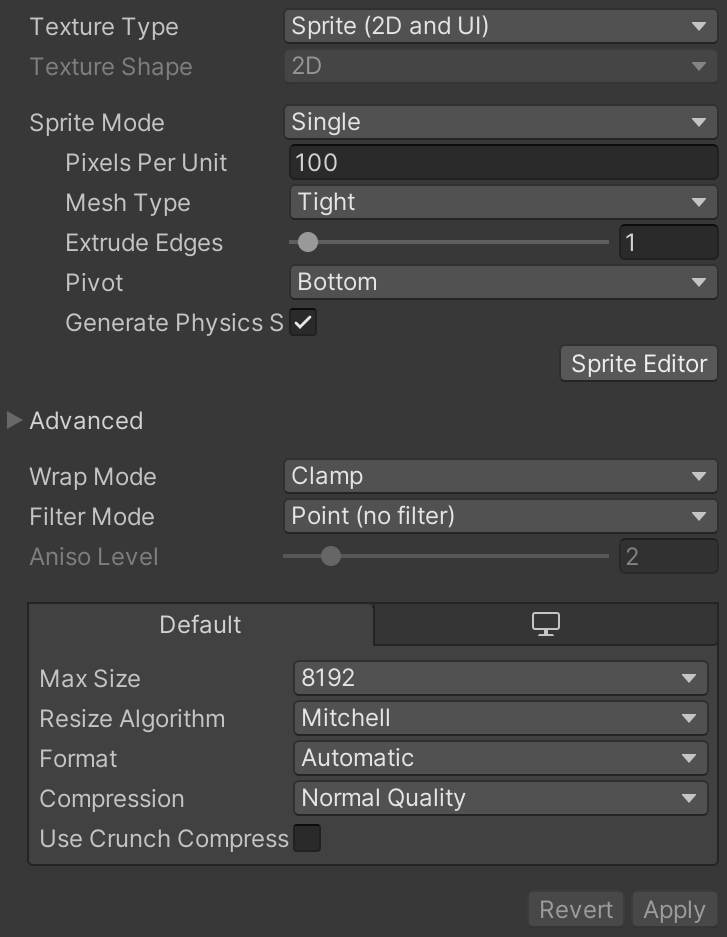
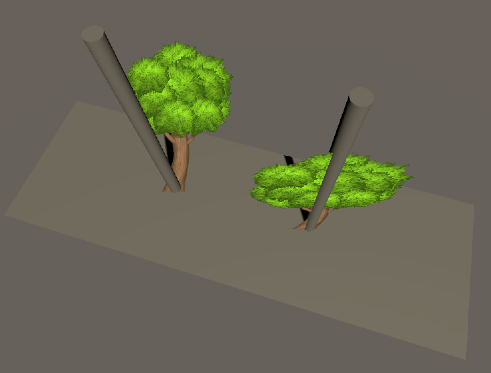
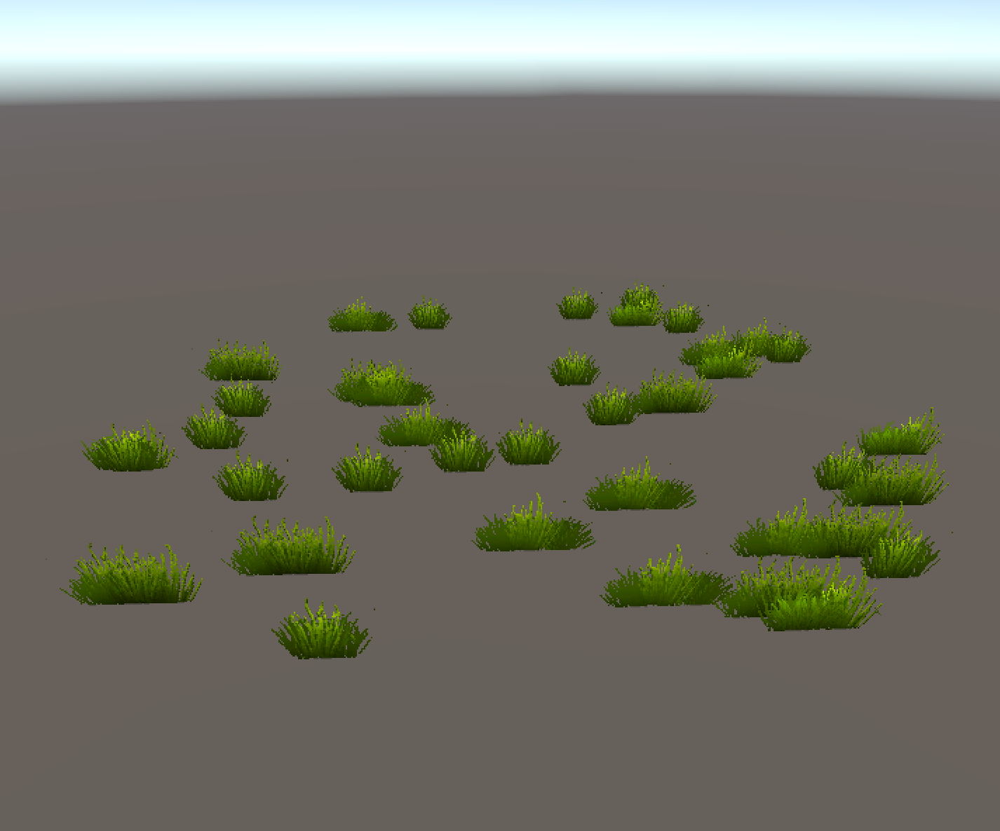
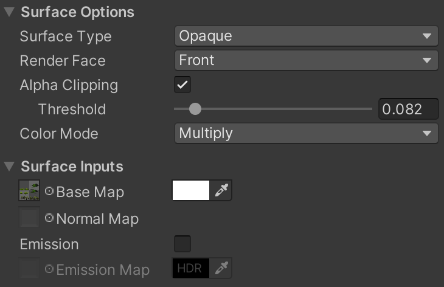

# Creating Billboard Sprites in Unity

Unity's support for billboarded items is poor. I wanted to investigate some different ways of creating billboarded sprites.

## Adding Sprite Textures

It is recommended to place sprite textures into the `Sprites` directory within your project's `Assets` directory. Any images within this directory will show up in the `Project` pane when the `Sprites` folder is opened.

To use an image as a sprite, select it in the `Inspector` and modify the following settings:

* **Main:**
  * Texture type: `Sprite (2D and UI)`
  * Sprite mode: `Single` (`Multiple` may be used later - see the section on randomising particle sprites)
  * Mesh type: best left as `Tight` to remove excess transparent areas
  * Pivot: variable, best placed depending on the image
  * Wrap mode: `Clamp`
  * Filter mode: `Point (no filter)` will give a pixelated look, or `Bilinear` or `Trilinear` will give a softer look
* **Advanced:**
  * Alpha source: `Input Texture Alpha`
  * Alpha Is Transparent: `true`



Unfortunately, there is no built-in Unity shader for standalone sprites that performs alpha thresholding on the edges of the image. Writing shaders from scratch in Unity looks rather complicated, so I'd have to research this in more detail to find out how to do it.

## Billboarding Sprite Objects In-Game

Adding a sprite to a scene is as simple as dragging the asset from the `Projects` pane into the scene.

To get the sprite to use billboard orientation, one approach is to add a script to the object to orient it along the camera view angles each frame.

```csharp
using System.Collections;
using System.Collections.Generic;
using UnityEngine;

public class SpriteBillboard : MonoBehaviour
{
    public Camera m_Camera = null;
    public bool m_RotateAroundVertical = false;

    void Awake()
    {
        if ( !m_Camera )
        {
            m_Camera = Camera.main;
        }
    }

    // Orient the camera after all movement is completed this frame to avoid jittering
    void LateUpdate()
    {
        if ( m_RotateAroundVertical )
        {
            Vector3 cameraForwardXZ = Vector3.ProjectOnPlane(m_Camera.transform.forward,
                                                             Vector3.up).normalized;
            transform.LookAt(transform.position - cameraForwardXZ);
        }
        else
        {
            transform.LookAt(transform.position - m_Camera.transform.forward,
                             m_Camera.transform.rotation * Vector3.up);
        }
    }
}
```

If `m_RotateAroundVertical` is `true` (right tree), the sprite stays upright but orients itself according to the camera. If it's `false` (left tree), the upward direction is set to be the same as the camera's up direction.



## Creating Sprite Materials for Particle Systems

Particle systems can also be used to display sprites in billboard orientation. This is mainly useful if you want to display lots of sprites at once (eg. grass).



To use a sprite in a particle system, a material must be created for it. Once the material is created and named appropriately, modify the following settings:

* **Surface Options:**
  * Surface type: `Opaque` if using alpha thresholding, `Transparent` if not
  * Alpha clipping: `true` if using alpha thresholding, `false` if not
  * Threshold: variable, depending on the image
  * Colour mode: variable, depending on the image
* **Surface Inputs:**
  * Base map: the sprite asset should be dragged onto this control to set it, and a colour tint can also be specified



## Creating Billboarded Sprites Using a Particle System

Create a particle system and place it in the scene.

The important properties that need to be set on the particle system are:

* **Main:**
  * Looping: `true`
  * Prewarm: `true` (this ensures that all sprites are spawned when the particle system starts)
  * Start lifetime: `Infinity` (this can be typed in verbatim)
  * Start speed: `0`
  * Start size: variable, depending on the desired size of the object
  * Max particles: variable, depending on the desired object count
  * Culling mode: `Pause` (if particles are not animated or moving, there's no point simulating them)
* **Emission:**
  * Rate over time: `0`
  * Rate over distance: `0`
  * Bursts: configure `1` burst at time `0`, spawning the required number of particles
* **Shape:**
  * If shape is `Box`:
    * Emit from: `Volume`
    * Y scale: something small (eg. `0.01`) approximates a rectangular plane on which the sprites spawn
    * X and Z scale: variable, depending on the desired area for spawning
  * If shape is `Cone`:
    * Angle: `0` creates a cone with no slope (ie. a cylinder)
    * Radius: variable, depending on size of spawn area
    * Radius thickness: `1` (allows spawning anywhere within the cone volume, instead of just around the edge)
    * Arc: `360`
    * Mode: `Random`
    * Spread: `0` (seems to affect "spoke" arrangements of spawned objects - `0` means randomly spawned)
    * Emit from: `Base` (to create a flat circle)
    * Rotation: `270` degrees on X, so that the cone base faces upwards
* **Renderer:**
  * Render mode: either `Billboard` or `Vertical Billboard`, depending on desired effect
  * Material: desired sprite material set up earlier
  * Sort mode: `By distance`
  * Min particle size: `0`
  * Max particle size: something large, as this affects how large the particles may appear on-screen - `10` seems to work for me

## Randomising Particle Sprites

It may be desirable to randomise the sprites displayed on each particle. eg. when placing a variety of grass or foliage. This can be achieved in two ways:

* Dividing the sprite sheet up *evenly* into cells, where each cell contains a different image to be displayed, and telling the particle system to use a random cell from *anywhere on the sheet*.
* Dividing the sprite sheet up *arbitrarily* into cells, where each cell contains a different image to be displayed, and telling the particle system to use a random cell *from a specified list*.

### Sheet Divided Evenly Into Cells

For this method, the particle effect itself is set up to calculate and use the cells - there is no need to do anything in the sprite editor. The one restriction is that the number of sprite variants must exactly match the total number of uniform cells the sheet is divided into.

To do this, change the following settings:

* **Texture Sheet Animation:**
  * Mode: `Grid`
  * Tiles: numbers on X and Y are variable, depending on how many cells you want
  * Animation: `Whole Sheet`
  * Time mode: `Lifetime` (since the particles' lifetimes are set to be infinite, only the first frame set in its lifetime actually matters)
  * Frame over time: in the dropdown arrow menu, choose `Constant` and set value to `0`
  * Start frame: in the dropdown arrow menu, choose `Random Between Two Constants`, and set the first value to `0` and the last value to `n` (where `n` is the total number of cells on the sprite sheet)
  * Cycles: `1`

### Sheet Divided Arbitrarily Into Cells

For this method, the sprite sheet cells must be defined using the sprite editor. The different sprites sourced from the sprite sheet can be displayed in the project view by clicking the arrow next to the sprite sheet asset.

Once the cells are created, the particle system must be set up to use them. The process is similar to above, but using the *sprites* mode rather than the *grid* mode.

Change the following settings:

* **Texture Sheet Animation:**
  * Mode: `Sprites`
  * Sprite list: add as many items to the list as desired, and assign each one a sprite (all sprites must be sourced from the same sheet)
  * Time mode: `Lifetime` (since the particles' lifetimes are set to be infinite, only the first frame set in its lifetime actually matters)
  * Frame over time: in the dropdown arrow menu, choose `Constant` and set value to 0
  * Start frame: in the dropdown arrow menu, choose `Random Between Two Constants`, and set the first value to `0` and the last value to `n` (where `n` is the total number of cells on the sprite sheet)
  * Cycles: `1`
